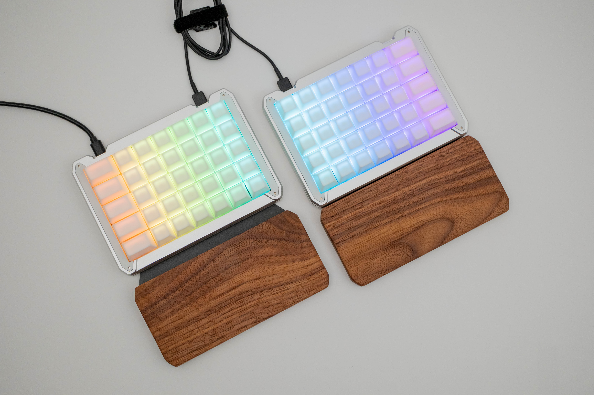
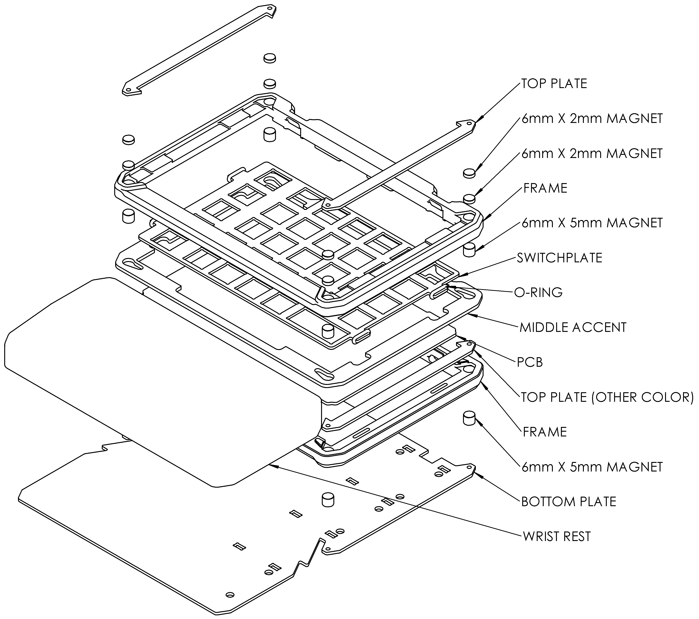

## Mün 2
The Mün 2 is the successor to the original Mün keyboard kit. The PCB has hotswap MX sockets with RGB backlight, 2x RP2040 microcontrollers, all-USB-C and ESD protection. An internal cable is provided to connect the PCBs together for certain 60% cases. You will need 70 switches, keycaps, and USB-C cables to complete a keyboard.

All files are provided on an as is basis. No guarantees or warranties are given or implied.

Kits are available [here](https://www.rgbkb.net/collections/mun) at RGBKB.net.

The split case has a few variants:
 * Aluminum: 19mm thickness
 * 3D Print: 15, 17, and 19mm thickness
Each half of the case uses two identical frame parts, one top and one bottom. The 3D print files include a "Top" model with the USB ports removed. They are provided with no shrink compensation, you will need to apply a scaling factor (something close to 100.5% for PLA) in order to get the parts to fit properly. Magnets and steel plates are used to secure the case together. Three case thicknesses are available using the following stackups:

| Layer Stackup | 19mm | 17mm | 15mm |
| --- | --- | --- | --- |
| 20091 Plate  |:white_check_mark:|:white_check_mark:|:white_check_mark:|
| 2mm Magnet   |:white_check_mark:|:white_check_mark:|   |
| 2mm Magnet   |:white_check_mark:|   |   |
| 5mm Magnet   |:white_check_mark:|   |   |
| Middle Accent|:white_check_mark:|   |   |
| 20091 Plate  |:white_check_mark:|:white_check_mark:|:white_check_mark:|
| 5mm Magnet   |:white_check_mark:|:white_check_mark:|:white_check_mark:|
| 20093 Plate  |:white_check_mark:|:white_check_mark:|:white_check_mark:|

Mün 2 BOM
Not all parts are mandatory, depending on your kit.

|Part Number | Qty |  Description  | Material | Thickness |  Note |
| ---------- | --- | ------------- | ------------- | ------------- | ------------- |
|      20077 |  8  |     SKUF Foot | Silicone | 1.5mm | Adhesive-backed
|      10087 |  1  |      Mun2 PCB | PCBA | 1.6mm | See Gerbers
|      40088 |  4  |         Frame | Aluminum | 11.5mmm | CNC
|      60098 |  4  |Tilt/tent foot | 3D-Printed | Various | Available in 8-32mm variants
|      60089 |  4  |         Frame | 3D-Printed | Various | Available in 19, 17, 15mm variants
|      20091 |  8  |Standard Top Plate | Steel | 1.6mm | Ferrous metal
|      20093 |  2  |Standard Bottom Plate | Steel | 1.6mm | Ferrous metal
|      20094 |  2  |Fullhand Bottom Plate | Steel | 1.6mm | Ferrous metal
|      20095 |  2  |Middle Accent Layer | Various | 2.0mm |
|      20096 |  2  |   Switchplate | Various | 1.5mm |
|      20097 |  2  |Switchplate w/ 2u stabs | Various | 1.5mm |
|      40114 |  2  |    Wrist rest | Wood | 17.4mm | Embed 3x 6mm magnet
|    Magnets |  8  |6mm Diameter magnet | Neodymium | 5mm | N48 or higher
|    Magnets |  8  |6mm Diameter magnet | Neodymium | 2mm | N48 or higher
|    O-Rings |  8  |AS568-010 Oring | Buna-N Rubber | 1.78mm |
| Dowel Pins |  8  |4mm x 8mm Dowel Pin | Steel | 8mm |

Below is the 19mm thick with wrist rest configuration.

